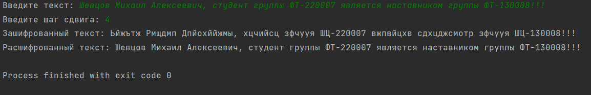

# Автор программы
Шевцов Михаил Фт-220007
# Описание программы
Программа шифрует и расшифровывает текст шифром Цезаря
# Запуск
Программа может запускаться в любой удобной среде программирования для Python
Необходимо открыть файл "Шифр Цезаря Шевцов Фт-220007.py"
____
*Пользователь вводит:* 
- текст
- шаг смещения
# Тесты
Тест программы в PyCharm Edu 2022.2.2
___

